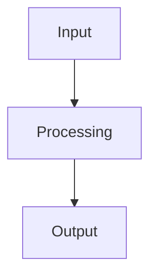

# Portfolio rebuild implementation plan

> **For agentic workers:** REQUIRED SUB-SKILL: Use superpowers:subagent-driven-development (recommended) or superpowers:executing-plans to implement this plan task-by-task. Steps use checkbox (`- [ ]`) syntax for tracking.

**Goal:** Rebuild vaillant.ai as an Eleventy site with project pages, preserving the CRT aesthetic, resume pipeline, and `?a=2` name switch.

**Architecture:** Eleventy consumes markdown project pages and resume.json via its data cascade. Templates extend a shared base layout with grid/drift/vignette. Mermaid diagrams render to SVG at build time. A shared JS module handles `?a=2` identity switching on all pages.

**Tech Stack:** Eleventy 3.x, Nunjucks templates, markdown-it, mermaid-cli, vitest, eslint, husky

---

### Task 1: Scaffold Eleventy and verify build

**Files:**
- Create: `.eleventy.js`
- Modify: `package.json`
- Modify: `vitest.config.js`
- Modify: `eslint.config.js`
- Create: `src/_data/.gitkeep` (placeholder until resume.json moves)
- Create: `src/index.njk` (minimal "hello world")
- Create: `public/CNAME` (copy from root)

- [ ] **Step 1: Install Eleventy**

Run: `npm install --save-dev @11ty/eleventy@3`
Expected: package.json devDependencies includes `@11ty/eleventy`

- [ ] **Step 2: Create Eleventy config**

```js
// .eleventy.js
export default function(eleventyConfig) {
  eleventyConfig.addPassthroughCopy('public');
  eleventyConfig.addPassthroughCopy('src/css');
  eleventyConfig.addPassthroughCopy('src/js');

  return {
    dir: {
      input: 'src',
      output: '_site',
      includes: '_includes',
      data: '_data'
    },
    templateFormats: ['njk', 'md'],
    htmlTemplateEngine: 'njk',
    markdownTemplateEngine: 'njk'
  };
}
```

- [ ] **Step 3: Create minimal index page**

```njk
{# src/index.njk #}
---
title: vaillant.ai
---
<!DOCTYPE html>
<html lang="en">
  <head>
    <meta charset="UTF-8">
    <title>{{ title }}</title>
    <meta name="viewport" content="width=device-width, initial-scale=1">
  </head>
  <body>
    <h1>vaillant.ai</h1>
  </body>
</html>
```

- [ ] **Step 4: Copy CNAME to public/**

Run: `mkdir -p public && cp CNAME public/CNAME`

- [ ] **Step 5: Add `_site/` to .gitignore**

Append `_site/` to `.gitignore`.

- [ ] **Step 6: Update package.json scripts**

Replace the `scripts` block:

```json
{
  "dev": "npx @11ty/eleventy --serve",
  "build": "npx @11ty/eleventy",
  "test": "vitest run",
  "test:watch": "vitest",
  "test:ui": "vitest --ui",
  "test:coverage": "vitest run --coverage",
  "lint": "eslint .",
  "validate": "npm run lint && npm run test",
  "prepare": "husky"
}
```

- [ ] **Step 7: Update eslint config to ignore Eleventy output and config**

Update `eslint.config.js` — add ignores for `_site/` and adjust file globs to cover `src/js/*.js` and `tests/*.js`:

```js
export default [
  {
    ignores: ['_site/**', '.eleventy.js']
  },
  {
    files: ['src/js/*.js'],
    languageOptions: {
      ecmaVersion: 2022,
      sourceType: 'module',
      globals: {
        document: 'readonly',
        window: 'readonly',
        console: 'readonly',
        HTMLElement: 'readonly',
        URLSearchParams: 'readonly',
        location: 'readonly',
        setTimeout: 'readonly'
      }
    },
    rules: {
      'no-unused-vars': ['error', { argsIgnorePattern: '^_' }],
      'no-undef': 'error',
      'no-console': 'off',
      'semi': ['error', 'always'],
      'quotes': ['error', 'single', { avoidEscape: true }]
    }
  },
  {
    files: ['tests/**/*.test.js'],
    languageOptions: {
      ecmaVersion: 2022,
      sourceType: 'module',
      globals: {
        describe: 'readonly',
        it: 'readonly',
        expect: 'readonly',
        beforeEach: 'readonly',
        afterEach: 'readonly',
        vi: 'readonly'
      }
    },
    rules: {
      'no-unused-vars': ['error', { argsIgnorePattern: '^_' }],
      'no-undef': 'error',
      'no-console': 'off',
      'semi': ['error', 'always'],
      'quotes': ['error', 'single', { avoidEscape: true }]
    }
  }
];
```

- [ ] **Step 8: Update vitest config for new paths**

```js
import { defineConfig } from 'vitest/config';

export default defineConfig({
  test: {
    environment: 'jsdom',
    globals: true,
    include: ['tests/**/*.test.js']
  }
});
```

- [ ] **Step 9: Write the failing build-output test**

Create `tests/build.test.js`:

```js
import { describe, it, expect } from 'vitest';
import { accessSync, readFileSync, constants } from 'fs';
import { resolve } from 'path';

describe('Eleventy Build Output', () => {
  it('should produce _site/index.html', () => {
    const filePath = resolve('./_site/index.html');
    expect(() => accessSync(filePath, constants.F_OK)).not.toThrow();
  });

  it('should produce valid HTML5 with DOCTYPE', () => {
    const content = readFileSync(resolve('./_site/index.html'), 'utf-8');
    expect(content).toMatch(/^<!DOCTYPE html>/i);
  });

  it('should have CNAME in output', () => {
    const filePath = resolve('./_site/CNAME');
    expect(() => accessSync(filePath, constants.F_OK)).not.toThrow();
    const content = readFileSync(filePath, 'utf-8');
    expect(content.trim()).toBe('vaillant.ai');
  });
});
```

- [ ] **Step 10: Run test to verify it fails**

Run: `npx vitest run tests/build.test.js`
Expected: FAIL — `_site/index.html` does not exist yet.

- [ ] **Step 11: Run the build**

Run: `npm run build`
Expected: Eleventy outputs `_site/index.html` and `_site/CNAME`.

- [ ] **Step 12: Run test to verify it passes**

Run: `npx vitest run tests/build.test.js`
Expected: 3 tests PASS.

- [ ] **Step 13: Commit**

```bash
git add .eleventy.js package.json package-lock.json vitest.config.js eslint.config.js \
  src/index.njk public/CNAME .gitignore tests/build.test.js
git commit -m "feat: scaffold Eleventy build with minimal index page"
```

---

### Task 2: Base layout with CRT aesthetic

**Files:**
- Create: `src/_includes/base.njk`
- Create: `src/css/site.css` (migrate from root `site.css`)
- Modify: `src/index.njk` (extend base layout)

- [ ] **Step 1: Migrate site.css**

Run: `mkdir -p src/css && cp site.css src/css/site.css`

- [ ] **Step 2: Create base layout**

```njk
{# src/_includes/base.njk #}
<!DOCTYPE html>
<html lang="en">
  <head>
    <meta charset="UTF-8">
    <title>{{ title }}</title>
    <meta name="description" content="{{ description or 'Aleister Vaillant — ML Engineer' }}">
    <meta name="viewport" content="width=device-width, initial-scale=1">
    <link rel="preconnect" href="https://fonts.googleapis.com">
    <link rel="preconnect" href="https://fonts.gstatic.com" crossorigin>
    <link href="https://fonts.googleapis.com/css2?family=IBM+Plex+Mono:wght@300;400;500&display=swap" rel="stylesheet">
    <link rel="stylesheet" href="/css/site.css">
    
  </head>
  <body class="{{ bodyClass }}">
    <div class="grid-bg" aria-hidden="true"></div>
    <div class="drift" aria-hidden="true"></div>

    

    <script src="/js/name-switch.js"></script>
  </body>
</html>
```

- [ ] **Step 3: Update index.njk to extend base**

```njk
{# src/index.njk #}
---
title: vaillant.ai
description: "If you're looking for A. Vaillant's website, this is it."
---



<main>
  <header class="ident">
    <h1 class="name" id="name" data-name>ALEISTER<br>VAILLANT</h1>
    <div class="label">ML Engineer — New York</div>
  </header>
</main>

```

- [ ] **Step 4: Create placeholder name-switch.js**

```js
// src/js/name-switch.js
// Name switch implementation — Task 5
```

- [ ] **Step 5: Write test for base layout elements**

Add to `tests/build.test.js`:

```js
describe('Base Layout', () => {
  let indexHtml;

  beforeEach(() => {
    indexHtml = readFileSync(resolve('./_site/index.html'), 'utf-8');
  });

  it('should have viewport meta tag', () => {
    expect(indexHtml).toContain('width=device-width');
  });

  it('should load site.css', () => {
    expect(indexHtml).toContain('href="/css/site.css"');
  });

  it('should load IBM Plex Mono', () => {
    expect(indexHtml).toContain('IBM+Plex+Mono');
  });

  it('should have grid-bg div', () => {
    expect(indexHtml).toContain('class="grid-bg"');
  });

  it('should have drift div', () => {
    expect(indexHtml).toContain('class="drift"');
  });

  it('should load name-switch.js', () => {
    expect(indexHtml).toContain('src="/js/name-switch.js"');
  });
});
```

- [ ] **Step 6: Run tests — expect failure**

Run: `npx vitest run tests/build.test.js`
Expected: FAIL — need to rebuild with new template.

- [ ] **Step 7: Rebuild**

Run: `npm run build`

- [ ] **Step 8: Run tests — expect pass**

Run: `npx vitest run tests/build.test.js`
Expected: All tests PASS.

- [ ] **Step 9: Commit**

```bash
git add src/_includes/base.njk src/css/site.css src/index.njk src/js/name-switch.js \
  tests/build.test.js
git commit -m "feat: base layout with CRT aesthetic and grid/drift/vignette"
```

---

### Task 3: Landing page with project cards

**Files:**
- Create: `src/projects/projects.json`
- Create: `src/projects/storyverse.md`
- Create: `src/projects/7drl.md`
- Create: `src/projects/paranoia-agent.md`
- Create: `src/projects/yapperbot.md`
- Create: `src/_includes/project.njk` (minimal — just needs to exist for directory data)
- Modify: `src/index.njk`

- [ ] **Step 1: Create directory data file**

```json
// src/projects/projects.json
{
  "layout": "project.njk",
  "tags": "project"
}
```

- [ ] **Step 2: Create project markdown files**

`src/projects/storyverse.md`:
```markdown
---
title: "Storyverse CV Pipeline"
subtitle: "Real-time object detection on edge hardware for live theater"
repo: null
demo: null
order: 1
---

## What it is

<!-- TODO: Alice writes this — one paragraph, lead with quantified impact -->

## Why it's hard

<!-- TODO: Alice writes this — the interesting engineering constraint -->

## How it works

<!-- TODO: Alice writes this — architecture and key decisions -->


<!-- TODO: Alice reviews/replaces diagram -->

## Decisions and tradeoffs

<!-- TODO: Alice writes this — why X over Y, what didn't work -->

## Metrics and outcomes

<!-- TODO: Alice writes this — quantified, not vanity -->
```

`src/projects/7drl.md`:
```markdown
---
title: "A Long Day in Hell"
subtitle: "Browser roguelike — 1200+ tests, procedural cosmology"
repo: "https://github.com/A-Vaillant/a-long-day-in-hell"
demo: null
order: 2
---

## What it is

<!-- TODO: Alice writes this — one paragraph, lead with quantified impact -->

## Why it's hard

<!-- TODO: Alice writes this — the interesting engineering constraint -->

## How it works

<!-- TODO: Alice writes this — architecture and key decisions -->


<!-- TODO: Alice reviews/replaces diagram -->

## Decisions and tradeoffs

<!-- TODO: Alice writes this — why X over Y, what didn't work -->

## Metrics and outcomes

<!-- TODO: Alice writes this — quantified, not vanity -->
```

`src/projects/paranoia-agent.md`:
```markdown
---
title: "Paranoia Agent"
subtitle: "Adversarial code reviewer with convergence scoring"
repo: "https://github.com/A-Vaillant/paranoia-agent"
demo: null
order: 3
---

## What it is

<!-- TODO: Alice writes this — one paragraph, lead with quantified impact -->

## Why it's hard

<!-- TODO: Alice writes this — the interesting engineering constraint -->

## How it works

<!-- TODO: Alice writes this — architecture and key decisions -->


<!-- TODO: Alice reviews/replaces diagram -->

## Decisions and tradeoffs

<!-- TODO: Alice writes this — why X over Y, what didn't work -->

## Metrics and outcomes

<!-- TODO: Alice writes this — quantified, not vanity -->
```

`src/projects/yapperbot.md`:
```markdown
---
title: "Yapperbot"
subtitle: "Grammar-constrained autonomous journaling agent"
repo: "https://github.com/A-Vaillant/yapperbot"
demo: null
order: 4
---

## What it is

<!-- TODO: Alice writes this — one paragraph, lead with quantified impact -->

## Why it's hard

<!-- TODO: Alice writes this — the interesting engineering constraint -->

## How it works

<!-- TODO: Alice writes this — architecture and key decisions -->


<!-- TODO: Alice reviews/replaces diagram -->

## Decisions and tradeoffs

<!-- TODO: Alice writes this — why X over Y, what didn't work -->

## Metrics and outcomes

<!-- TODO: Alice writes this — quantified, not vanity -->
```

- [ ] **Step 3: Create minimal project layout**

```njk
{# src/_includes/project.njk #}



<main class="project-page">
  <h1>{{ title }}</h1>
  {{ content | safe }}
</main>

```

This is a placeholder — Task 6 builds the full project template.

- [ ] **Step 4: Update landing page with project cards and secondary links**

```njk
{# src/index.njk #}
---
title: vaillant.ai
description: "If you're looking for A. Vaillant's website, this is it."
---



<main>
  <header class="ident">
    <h1 class="name" id="name" data-name>ALEISTER<br>VAILLANT</h1>
    <div class="label">ML Engineer — New York</div>
  </header>

  <nav class="projects" aria-label="Projects">
    
    <a href="{{ project.url }}" class="project-card">
      <span class="project-card-title">{{ project.data.title }}</span>
      <span class="project-card-subtitle">{{ project.data.subtitle }}</span>
    </a>
    
  </nav>

  <nav class="meta-links" aria-label="Contact and profiles">
    <a href="resume.html">Resume</a>
    <a href="https://github.com/A-Vaillant">GitHub</a>
    <a href="https://www.linkedin.com/in/alvaillant/">LinkedIn</a>
    <a href="mailto:aleister@vaillant.ai" data-email>aleister@vaillant.ai</a>
  </nav>
</main>

```

- [ ] **Step 5: Add project card and meta-links styles to site.css**

Append to `src/css/site.css`:

```css
/* project cards — primary navigation */
.projects {
  display: flex;
  flex-direction: column;
  gap: 0.6rem;
  margin-bottom: 2rem;
}

.project-card {
  display: block;
  text-decoration: none;
  border-left: 2px solid var(--accent-dim);
  padding-left: 0.75rem;
  transition: border-color 0.3s, padding-left 0.3s;
}

.project-card:hover {
  border-color: var(--accent-bright);
  padding-left: 1rem;
}

.project-card-title {
  display: block;
  color: var(--accent);
  font-size: 0.85rem;
}

.project-card:hover .project-card-title {
  color: var(--accent-bright);
}

.project-card-subtitle {
  display: block;
  color: var(--accent-dim);
  font-size: 0.7rem;
}

/* secondary links — contact, profiles */
.meta-links {
  border-top: 1px solid rgba(180, 199, 217, 0.06);
  padding-top: 0.75rem;
  display: flex;
  flex-wrap: wrap;
  gap: 1.2rem;
  font-size: 0.75rem;
}

.meta-links a {
  color: var(--accent-dim);
  text-decoration: none;
  transition: color 0.3s;
}

.meta-links a:hover {
  color: var(--accent-bright);
}

@media (max-width: 600px) {
  .project-card-title {
    font-size: 0.9rem;
  }

  .project-card-subtitle {
    font-size: 0.75rem;
  }

  .meta-links {
    gap: 0.8rem;
    font-size: 0.8rem;
  }
}
```

- [ ] **Step 6: Write landing page tests**

Create `tests/landing.test.js`:

```js
import { describe, it, expect, beforeEach } from 'vitest';
import { readFileSync } from 'fs';
import { resolve } from 'path';

describe('Landing Page', () => {
  let html;
  let doc;

  beforeEach(() => {
    html = readFileSync(resolve('./_site/index.html'), 'utf-8');
    document.body.innerHTML = html;
  });

  it('should have h1 with name', () => {
    const h1 = document.querySelector('h1');
    expect(h1).toBeTruthy();
    expect(h1.textContent).toContain('ALEISTER');
    expect(h1.textContent).toContain('VAILLANT');
  });

  it('should have data-name attribute on h1', () => {
    const h1 = document.querySelector('h1');
    expect(h1.hasAttribute('data-name')).toBe(true);
  });

  it('should have 4 project cards', () => {
    const cards = document.querySelectorAll('.project-card');
    expect(cards.length).toBe(4);
  });

  it('should display project cards in order', () => {
    const titles = Array.from(document.querySelectorAll('.project-card-title'))
      .map(el => el.textContent.trim());
    expect(titles).toEqual([
      'Storyverse CV Pipeline',
      'A Long Day in Hell',
      'Paranoia Agent',
      'Yapperbot'
    ]);
  });

  it('should have subtitles on each card', () => {
    const subtitles = document.querySelectorAll('.project-card-subtitle');
    expect(subtitles.length).toBe(4);
    subtitles.forEach(sub => {
      expect(sub.textContent.trim().length).toBeGreaterThan(0);
    });
  });

  it('should have meta-links section with Resume, GitHub, LinkedIn, Email', () => {
    const metaLinks = document.querySelectorAll('.meta-links a');
    const texts = Array.from(metaLinks).map(a => a.textContent.trim());
    expect(texts).toContain('Resume');
    expect(texts).toContain('GitHub');
    expect(texts).toContain('LinkedIn');
    expect(texts.some(t => t.includes('@vaillant.ai'))).toBe(true);
  });

  it('should have data-email attribute on email link', () => {
    const emailLink = document.querySelector('.meta-links a[data-email]');
    expect(emailLink).toBeTruthy();
  });

  it('project card links should point to project pages', () => {
    const links = Array.from(document.querySelectorAll('.project-card'))
      .map(a => a.getAttribute('href'));
    expect(links).toContain('/projects/storyverse/');
    expect(links).toContain('/projects/7drl/');
    expect(links).toContain('/projects/paranoia-agent/');
    expect(links).toContain('/projects/yapperbot/');
  });
});
```

- [ ] **Step 7: Run tests — expect failure**

Run: `npx vitest run tests/landing.test.js`
Expected: FAIL — no build output yet.

- [ ] **Step 8: Rebuild**

Run: `npm run build`

- [ ] **Step 9: Run tests — expect pass**

Run: `npx vitest run tests/landing.test.js`
Expected: All tests PASS. If the project URLs don't match expectations (Eleventy may produce `/projects/storyverse/` or `/projects/storyverse.html` depending on permalink config), adjust the test assertions or add a permalink to `.eleventy.js`.

- [ ] **Step 10: Commit**

```bash
git add src/projects/ src/_includes/project.njk src/index.njk src/css/site.css \
  tests/landing.test.js
git commit -m "feat: landing page with project cards and secondary link row"
```

---

### Task 4: Resume page migration

**Files:**
- Create: `src/_data/resume.json` (move from root)
- Create: `src/resume.njk`
- Create: `src/_includes/resume.njk`
- Create: `src/css/resume.css` (migrate from root)
- Create: `src/js/resume.js` (migrate from root, remove inline name-switch code)

- [ ] **Step 1: Move resume.json to data directory**

Run: `mkdir -p src/_data && cp resume.json src/_data/resume.json`

- [ ] **Step 2: Move resume.css**

Run: `cp resume.css src/css/resume.css`

- [ ] **Step 3: Migrate resume.js — remove inline name-switch code**

Create `src/js/resume.js` with the existing hydration logic but without the `?a=2` block at the bottom (that moves to `name-switch.js` in Task 5):

```js
// src/js/resume.js
let resumeDataScript = document.getElementById('resume-data');
let resumeData = null;

if (resumeDataScript) {
  try {
    resumeData = JSON.parse(resumeDataScript.textContent);
  } catch (e) {
    console.error('Failed to parse resume data:', e);
  }
}

function loadResume() {
  if (!resumeData) {
    document.getElementById('resume-name').textContent = 'No Resume Data';
    return;
  }
  renderResume(resumeData);
}

function renderResume(data) {
  const basics = data.basics || {};

  document.getElementById('resume-name').textContent = basics.name || '';
  document.getElementById('resume-email').textContent = basics.email || '';
  document.getElementById('resume-email').href = `mailto:${basics.email || ''}`;

  const loc = basics.location ? `${basics.location.city}, ${basics.location.region}` : '';
  document.getElementById('resume-location').textContent = loc;

  const github = basics.profiles?.find(p => p.network === 'GitHub')?.url || '';
  const linkedin = basics.profiles?.find(p => p.network === 'LinkedIn')?.url || '';
  document.getElementById('resume-github').href = github;
  document.getElementById('resume-linkedin').href = linkedin;

  // Summary
  document.querySelector('#summary .summary-text').textContent = basics.summary?.trim() || '';

  // Experience
  const expBody = document.querySelector('#experience .section-body');
  if (data.work?.length) {
    expBody.innerHTML = data.work.map(w => `
      <div class="item">
        <div class="item-role">${w.position}</div>
        <div class="item-org">${w.name}</div>
        <div class="item-date">${w.startDate} — ${w.endDate || 'Present'}</div>
        ${w.summary ? `<div class="item-summary">${w.summary}</div>` : ''}
        ${w.highlights?.length ? `
          <ul class="item-highlights">
            ${w.highlights.map(h => `<li>${h}</li>`).join('')}
          </ul>
        ` : ''}
      </div>
    `).join('');
  }

  // Education
  const eduBody = document.querySelector('#education .section-body');
  if (data.education?.length) {
    eduBody.innerHTML = data.education.map(e => `
      <div class="item">
        <div class="item-role">${e.studyType}</div>
        <div class="item-org">${e.institution} — ${e.area}</div>
        <div class="item-date">${e.startDate} — ${e.endDate}${e.gpa ? ` · GPA ${e.gpa}` : ''}</div>
        ${e.courses?.length ? `
          <div class="item-courses">${e.courses.join(' · ')}</div>
        ` : ''}
      </div>
    `).join('');
  }

  // Projects
  const projBody = document.querySelector('#projects .section-body');
  if (data.projects?.length) {
    projBody.innerHTML = data.projects.map(p => `
      <div class="project">
        <div class="project-name">${p.url ? `<a href="${p.url}" target="_blank">${p.name} →</a>` : p.name}</div>
        <div class="project-desc">${p.description || ''}</div>
        ${p.keywords?.length ? `
          <div class="project-tech">
            ${p.keywords.map(k => `<span>${k}</span>`).join('')}
          </div>
        ` : ''}
      </div>
    `).join('');
  }

  // Skills
  const skillsBody = document.querySelector('#skills .section-body');
  if (data.skills?.length) {
    skillsBody.innerHTML = data.skills.map(s => `
      <div class="skill-group">
        <h3>${s.name}</h3>
        <ul>${s.keywords.map(k => `<li>${k}</li>`).join('')}</ul>
      </div>
    `).join('');
  }
}

loadResume();
```

- [ ] **Step 4: Create resume layout**

```njk
{# src/_includes/resume.njk #}






<link rel="stylesheet" href="/css/resume.css">



<div class="resume-container">
  <nav class="resume-nav">
    <a href="/" id="back-link">← index</a>
  </nav>

  <header class="resume-header">
    <h1 class="resume-name" id="resume-name" data-name>Loading...</h1>
    <div class="resume-contact">
      <a id="resume-email" href="mailto:" data-email></a>
      <span id="resume-location"></span>
      <a id="resume-github" href="" target="_blank">GitHub</a>
      <a id="resume-linkedin" href="" target="_blank">LinkedIn</a>
    </div>
  </header>

  <section id="summary" class="section">
    <p class="summary-text"></p>
  </section>

  <section id="experience" class="section">
    <h2 class="section-label">Experience</h2>
    <div class="section-body"></div>
  </section>

  <section id="education" class="section">
    <h2 class="section-label">Education</h2>
    <div class="section-body"></div>
  </section>

  <section id="projects" class="section">
    <h2 class="section-label">Projects</h2>
    <div class="section-body"></div>
  </section>

  <section id="skills" class="section">
    <h2 class="section-label">Skills</h2>
    <div class="section-body skills-body"></div>
  </section>
</div>

<script type="application/json" id="resume-data">
{{ resume | dump(2) | safe }}
</script>
<script src="/js/resume.js"></script>

```

- [ ] **Step 5: Create resume page template**

```njk
{# src/resume.njk #}
---
title: Resume — Aleister Vaillant
description: Resume for Aleister Vaillant
layout: resume.njk
permalink: /resume.html
---
```

The layout does all the work. The page file just sets frontmatter.

- [ ] **Step 6: Write resume tests**

Create `tests/resume.test.js`:

```js
import { describe, it, expect, beforeEach } from 'vitest';
import { readFileSync, accessSync, constants } from 'fs';
import { resolve } from 'path';

describe('Resume Page', () => {
  let html;

  beforeEach(() => {
    html = readFileSync(resolve('./_site/resume.html'), 'utf-8');
  });

  it('should produce resume.html in build output', () => {
    expect(() => accessSync(resolve('./_site/resume.html'), constants.F_OK)).not.toThrow();
  });

  it('should be valid HTML5', () => {
    expect(html).toMatch(/^<!DOCTYPE html>/i);
  });

  it('should load resume.css', () => {
    expect(html).toContain('href="/css/resume.css"');
  });

  it('should load resume.js', () => {
    expect(html).toContain('src="/js/resume.js"');
  });

  it('should embed resume data as JSON', () => {
    expect(html).toContain('id="resume-data"');
    // Verify it contains actual data from resume.json
    expect(html).toContain('Aleister Vaillant');
    expect(html).toContain('ML/CV Engineer');
  });

  it('should have data-name attribute on resume name element', () => {
    expect(html).toContain('data-name');
  });

  it('should have data-email attribute on resume email element', () => {
    expect(html).toContain('data-email');
  });

  it('should have back link to index', () => {
    document.body.innerHTML = html;
    const backLink = document.querySelector('#back-link');
    expect(backLink).toBeTruthy();
    expect(backLink.getAttribute('href')).toBe('/');
  });

  it('should have resume.css file in output', () => {
    expect(() => accessSync(resolve('./_site/css/resume.css'), constants.F_OK)).not.toThrow();
  });

  it('should have resume.js file in output', () => {
    expect(() => accessSync(resolve('./_site/js/resume.js'), constants.F_OK)).not.toThrow();
  });

  it('should have all resume sections', () => {
    document.body.innerHTML = html;
    expect(document.querySelector('#summary')).toBeTruthy();
    expect(document.querySelector('#experience')).toBeTruthy();
    expect(document.querySelector('#education')).toBeTruthy();
    expect(document.querySelector('#projects')).toBeTruthy();
    expect(document.querySelector('#skills')).toBeTruthy();
  });
});
```

- [ ] **Step 7: Run tests — expect failure**

Run: `npx vitest run tests/resume.test.js`
Expected: FAIL — no build output.

- [ ] **Step 8: Rebuild**

Run: `npm run build`

- [ ] **Step 9: Run tests — expect pass**

Run: `npx vitest run tests/resume.test.js`
Expected: All tests PASS.

- [ ] **Step 10: Run full test suite**

Run: `npx vitest run`
Expected: All tests in `tests/build.test.js`, `tests/landing.test.js`, `tests/resume.test.js` PASS.

- [ ] **Step 11: Commit**

```bash
git add src/_data/resume.json src/resume.njk src/_includes/resume.njk \
  src/css/resume.css src/js/resume.js tests/resume.test.js
git commit -m "feat: migrate resume page to Eleventy with data cascade"
```

---

### Task 5: Name switch (`?a=2`) shared module

**Files:**
- Modify: `src/js/name-switch.js`

- [ ] **Step 1: Write name-switch tests**

Create `tests/name-switch.test.js`:

```js
import { describe, it, expect, beforeEach } from 'vitest';
import { readFileSync } from 'fs';
import { resolve } from 'path';

describe('Name Switch Module', () => {
  const scriptContent = readFileSync(resolve('./src/js/name-switch.js'), 'utf-8');

  it('should not contain plaintext alternate name', () => {
    // Check that "Alice" does not appear as a string literal
    // Allow it in comments but not in executable code
    const codeLines = scriptContent.split('\n')
      .filter(line => !line.trim().startsWith('//'));
    const codeOnly = codeLines.join('\n');
    expect(codeOnly).not.toMatch(/['"`]Alice['"`]/i);
    expect(codeOnly).not.toMatch(/['"`]alice@/i);
  });

  it('should use charcode encoding for the alternate name', () => {
    expect(scriptContent).toContain('String.fromCharCode');
  });

  it('should check for ?a=2 parameter', () => {
    expect(scriptContent).toContain('URLSearchParams');
  });

  it('should target data-name attributes', () => {
    expect(scriptContent).toContain('data-name');
  });

  it('should target data-email attributes', () => {
    expect(scriptContent).toContain('data-email');
  });
});

describe('Name Switch in Build Output', () => {
  it('should not contain plaintext alternate name in any output HTML', () => {
    const files = [
      './_site/index.html',
      './_site/resume.html'
    ];
    for (const file of files) {
      try {
        const content = readFileSync(resolve(file), 'utf-8');
        expect(content).not.toMatch(/Alice/);
        expect(content).not.toMatch(/alice@/);
      } catch {
        // File may not exist yet — skip
      }
    }
  });
});
```

- [ ] **Step 2: Run tests — expect failure**

Run: `npx vitest run tests/name-switch.test.js`
Expected: FAIL — name-switch.js is a placeholder.

- [ ] **Step 3: Implement name-switch.js**

```js
// src/js/name-switch.js
(function () {
  const params = new URLSearchParams(location.search);
  const cfg = params.get('a');
  if (!cfg || parseInt(cfg) !== 2) return;

  // Alternate name via charcode — no plaintext in source
  const altFirst = String.fromCharCode(65, 76, 73, 67, 69); // 5 chars
  const altFirstLower = String.fromCharCode(97, 108, 105, 99, 101);
  const altEmail = String.fromCharCode(
    97, 108, 105, 99, 101, 64, 118, 97, 105, 108, 108, 97, 110, 116, 46, 97, 105
  );
  const origFirst = String.fromCharCode(65, 108, 101, 105, 115, 116, 101, 114);
  const origFirstLower = String.fromCharCode(97, 108, 101, 105, 115, 116, 101, 114);

  // Replace name in all data-name elements
  document.querySelectorAll('[data-name]').forEach(function (el) {
    if (el.innerHTML.includes(origFirst.toUpperCase())) {
      el.innerHTML = el.innerHTML.replace(origFirst.toUpperCase(), altFirst.toUpperCase());
    } else if (el.textContent.includes(origFirst)) {
      el.textContent = el.textContent.replace(origFirst, altFirst);
    }
  });

  // Replace email in all data-email elements
  document.querySelectorAll('[data-email]').forEach(function (el) {
    if (el.textContent.includes(origFirstLower)) {
      el.textContent = altEmail;
      if (el.href) el.href = 'mailto:' + altEmail;
    }
  });

  // Propagate ?a=2 to all internal links
  document.querySelectorAll('a[href]').forEach(function (el) {
    const href = el.getAttribute('href');
    if (!href) return;
    // Skip external links, mailto, and anchors
    if (href.startsWith('http') || href.startsWith('mailto:') || href.startsWith('#')) return;
    const separator = href.includes('?') ? '&' : '?';
    el.setAttribute('href', href + separator + 'a=' + cfg);
  });
})();
```

- [ ] **Step 4: Run tests — expect pass**

Run: `npx vitest run tests/name-switch.test.js`
Expected: All tests PASS.

- [ ] **Step 5: Rebuild and run full suite**

Run: `npm run build && npx vitest run`
Expected: All tests PASS.

- [ ] **Step 6: Commit**

```bash
git add src/js/name-switch.js tests/name-switch.test.js
git commit -m "feat: shared name-switch module for ?a=2 identity switching"
```

---

### Task 6: Project page template and styles

**Files:**
- Modify: `src/_includes/project.njk`
- Create: `src/css/project.css`

- [ ] **Step 1: Write project page tests**

Create `tests/project-pages.test.js`:

```js
import { describe, it, expect } from 'vitest';
import { readFileSync, accessSync, constants } from 'fs';
import { resolve } from 'path';

const projectSlugs = ['storyverse', '7drl', 'paranoia-agent', 'yapperbot'];

describe('Project Pages', () => {
  for (const slug of projectSlugs) {
    describe(slug, () => {
      let html;

      it(`should produce ${slug}/index.html in build output`, () => {
        const filePath = resolve(`./_site/projects/${slug}/index.html`);
        expect(() => accessSync(filePath, constants.F_OK)).not.toThrow();
        html = readFileSync(filePath, 'utf-8');
      });

      it('should be valid HTML5', () => {
        if (!html) html = readFileSync(resolve(`./_site/projects/${slug}/index.html`), 'utf-8');
        expect(html).toMatch(/^<!DOCTYPE html>/i);
      });

      it('should load project.css', () => {
        if (!html) html = readFileSync(resolve(`./_site/projects/${slug}/index.html`), 'utf-8');
        expect(html).toContain('href="/css/project.css"');
      });

      it('should have an h1 with the project title', () => {
        if (!html) html = readFileSync(resolve(`./_site/projects/${slug}/index.html`), 'utf-8');
        document.body.innerHTML = html;
        const h1 = document.querySelector('h1');
        expect(h1).toBeTruthy();
        expect(h1.textContent.trim().length).toBeGreaterThan(0);
      });

      it('should have a back link to index', () => {
        if (!html) html = readFileSync(resolve(`./_site/projects/${slug}/index.html`), 'utf-8');
        document.body.innerHTML = html;
        const backLink = document.querySelector('.project-nav a');
        expect(backLink).toBeTruthy();
        expect(backLink.getAttribute('href')).toBe('/');
      });

      it('should have section headings', () => {
        if (!html) html = readFileSync(resolve(`./_site/projects/${slug}/index.html`), 'utf-8');
        document.body.innerHTML = html;
        const headings = Array.from(document.querySelectorAll('h2'))
          .map(h => h.textContent.trim());
        expect(headings).toContain('What it is');
        expect(headings).toContain('Why it\'s hard');
        expect(headings).toContain('How it works');
        expect(headings).toContain('Decisions and tradeoffs');
        expect(headings).toContain('Metrics and outcomes');
      });
    });
  }

  it('should have project.css in build output', () => {
    expect(() => accessSync(resolve('./_site/css/project.css'), constants.F_OK)).not.toThrow();
  });
});
```

- [ ] **Step 2: Run tests — expect failure**

Run: `npx vitest run tests/project-pages.test.js`
Expected: FAIL — project template is minimal, no project.css.

- [ ] **Step 3: Build the full project template**

```njk
{# src/_includes/project.njk #}



<link rel="stylesheet" href="/css/project.css">



<div class="project-container">
  <nav class="project-nav">
    <a href="/">← index</a>
  </nav>

  <header class="project-header">
    <h1 class="project-title">{{ title }}</h1>
    <div class="project-subtitle">{{ subtitle }}</div>
  </header>

  <article class="project-body">
    {{ content | safe }}
  </article>

  
  <footer class="project-footer">
    <a href="{{ repo }}" target="_blank" rel="noopener">GitHub →</a>
    <a href="{{ demo }}" target="_blank" rel="noopener">Live Demo →</a>
  </footer>
  
</div>

```

- [ ] **Step 4: Create project.css**

```css
/* src/css/project.css */
/* project pages — long-form reading */

.project-container {
  max-width: 680px;
  margin: 0 auto;
  padding: 4rem 2rem 6rem;
  position: relative;
  z-index: 1;
}

/* suppress vignette for scrollable pages */
body:has(.project-container)::after {
  display: none;
}

body:has(.project-container) {
  display: block;
  overflow-x: hidden;
  overflow-y: auto;
  align-items: initial;
  justify-content: initial;
}

/* nav */
.project-nav {
  margin-bottom: 4rem;
}

.project-nav a {
  color: var(--accent-dim);
  text-decoration: none;
  font-size: 0.75rem;
  letter-spacing: 0.1em;
  transition: color 0.3s;
}

.project-nav a:hover {
  color: var(--accent-bright);
}

/* header */
.project-header {
  margin-bottom: 3rem;
  padding-bottom: 2rem;
  border-bottom: 1px solid rgba(180, 199, 217, 0.1);
}

.project-title {
  font-size: clamp(1.8rem, 4vw, 2.5rem);
  font-weight: 300;
  letter-spacing: 0.05em;
  color: var(--accent-bright);
  line-height: 1.1;
  margin-bottom: 0.75rem;
}

.project-subtitle {
  font-size: 0.8rem;
  color: var(--accent-dim);
  letter-spacing: 0.03em;
}

/* body content */
.project-body h2 {
  font-size: 0.65rem;
  font-weight: 500;
  letter-spacing: 0.35em;
  text-transform: uppercase;
  color: var(--accent-dim);
  margin-top: 3rem;
  margin-bottom: 1rem;
  padding-bottom: 0.5rem;
  border-bottom: 1px solid rgba(180, 199, 217, 0.08);
}

.project-body p {
  font-size: 0.85rem;
  color: var(--text);
  line-height: 1.8;
  margin-bottom: 1rem;
}

.project-body ul,
.project-body ol {
  padding-left: 1.2rem;
  margin-bottom: 1rem;
}

.project-body li {
  font-size: 0.85rem;
  color: var(--text);
  line-height: 1.7;
  margin-bottom: 0.3rem;
}

.project-body code {
  font-family: 'IBM Plex Mono', monospace;
  font-size: 0.8rem;
  color: var(--accent);
  background: var(--bg-elevated);
  padding: 0.1rem 0.3rem;
  border: 1px solid rgba(180, 199, 217, 0.08);
}

.project-body pre {
  background: var(--bg-elevated);
  border: 1px solid rgba(180, 199, 217, 0.08);
  padding: 1rem;
  overflow-x: auto;
  margin-bottom: 1.5rem;
}

.project-body pre code {
  background: none;
  border: none;
  padding: 0;
}

/* mermaid SVG diagrams */
.project-body svg {
  max-width: 100%;
  height: auto;
  margin: 1.5rem 0;
}

/* footer links */
.project-footer {
  margin-top: 4rem;
  padding-top: 1.5rem;
  border-top: 1px solid rgba(180, 199, 217, 0.08);
  display: flex;
  gap: 1.5rem;
}

.project-footer a {
  color: var(--accent-dim);
  text-decoration: none;
  font-size: 0.8rem;
  letter-spacing: 0.05em;
  transition: color 0.3s;
}

.project-footer a:hover {
  color: var(--accent-bright);
}

@media (max-width: 600px) {
  .project-container {
    padding: 2rem 1.25rem 4rem;
  }

  .project-nav {
    margin-bottom: 2rem;
  }

  .project-nav a {
    font-size: 0.85rem;
    padding: 0.5rem 0;
    display: inline-block;
  }

  .project-title {
    font-size: 1.6rem;
  }

  .project-body p,
  .project-body li {
    font-size: 0.9rem;
  }
}
```

- [ ] **Step 5: Rebuild**

Run: `npm run build`

- [ ] **Step 6: Run tests — expect pass**

Run: `npx vitest run tests/project-pages.test.js`
Expected: All tests PASS.

- [ ] **Step 7: Run full suite**

Run: `npx vitest run`
Expected: All tests PASS.

- [ ] **Step 8: Commit**

```bash
git add src/_includes/project.njk src/css/project.css tests/project-pages.test.js
git commit -m "feat: project page template with CRT-consistent long-form styles"
```

---

### Task 7: Mermaid build-time rendering

**Files:**
- Modify: `.eleventy.js`
- Create: `.mermaidrc.json`

- [ ] **Step 1: Install mermaid-cli**

Run: `npm install --save-dev @mermaid-js/mermaid-cli`
Expected: `mmdc` binary available in `node_modules/.bin/`.

- [ ] **Step 2: Create mermaid config**

```json
// .mermaidrc.json
{
  "theme": "dark",
  "themeVariables": {
    "primaryColor": "#0e1014",
    "primaryTextColor": "#b4c7d9",
    "primaryBorderColor": "#5a7080",
    "lineColor": "#5a7080",
    "secondaryColor": "#0e1014",
    "tertiaryColor": "#0e1014",
    "background": "transparent"
  }
}
```

- [ ] **Step 3: Write mermaid rendering test**

Add to `tests/project-pages.test.js`:

```js
describe('Mermaid Rendering', () => {
  it('should not have unrendered mermaid code blocks in output', () => {
    for (const slug of projectSlugs) {
      const html = readFileSync(resolve(`./_site/projects/${slug}/index.html`), 'utf-8');
      expect(html).not.toContain('class="language-mermaid"');
    }
  });

  it('should have rendered SVG elements in project pages with mermaid diagrams', () => {
    // At least one project should have an SVG from a mermaid block
    let foundSvg = false;
    for (const slug of projectSlugs) {
      const html = readFileSync(resolve(`./_site/projects/${slug}/index.html`), 'utf-8');
      if (html.includes('<svg')) {
        foundSvg = true;
        break;
      }
    }
    expect(foundSvg).toBe(true);
  });
});
```

- [ ] **Step 4: Run test — expect failure**

Run: `npm run build && npx vitest run tests/project-pages.test.js`
Expected: FAIL — mermaid blocks are still `<code class="language-mermaid">`.

- [ ] **Step 5: Add mermaid transform to Eleventy config**

Update `.eleventy.js`:

```js
import { execSync } from 'child_process';
import { writeFileSync, readFileSync, mkdirSync } from 'fs';
import { join } from 'path';
import { tmpdir } from 'os';

export default function(eleventyConfig) {
  eleventyConfig.addPassthroughCopy('public');
  eleventyConfig.addPassthroughCopy('src/css');
  eleventyConfig.addPassthroughCopy('src/js');

  // Mermaid build-time transform: replace fenced mermaid blocks with inline SVGs
  eleventyConfig.addTransform('mermaid', function(content) {
    if (!this.page.outputPath || !this.page.outputPath.endsWith('.html')) {
      return content;
    }

    const mermaidRegex = /<pre><code class="language-mermaid">([\s\S]*?)<\/code><\/pre>/g;
    let match;
    let result = content;

    while ((match = mermaidRegex.exec(content)) !== null) {
      const diagramSource = match[1]
        .replace(/&lt;/g, '<')
        .replace(/&gt;/g, '>')
        .replace(/&amp;/g, '&')
        .replace(/&#39;/g, "'")
        .replace(/&quot;/g, '"');

      const tempDir = mkdirSync(join(tmpdir(), 'mermaid-' + Date.now()), { recursive: true });
      const inputPath = join(tempDir, 'input.mmd');
      const outputPath = join(tempDir, 'output.svg');

      writeFileSync(inputPath, diagramSource);

      try {
        execSync(
          `npx mmdc -i "${inputPath}" -o "${outputPath}" -c .mermaidrc.json -b transparent`,
          { stdio: 'pipe', timeout: 30000 }
        );
        const svg = readFileSync(outputPath, 'utf-8');
        result = result.replace(match[0], svg);
      } catch (err) {
        console.error('Mermaid render failed:', err.message);
        // Leave the code block as-is on failure
      }
    }

    return result;
  });

  return {
    dir: {
      input: 'src',
      output: '_site',
      includes: '_includes',
      data: '_data'
    },
    templateFormats: ['njk', 'md'],
    htmlTemplateEngine: 'njk',
    markdownTemplateEngine: 'njk'
  };
}
```

- [ ] **Step 6: Rebuild**

Run: `npm run build`
Expected: Build succeeds. Mermaid blocks in project pages are replaced with `<svg>` elements.

- [ ] **Step 7: Run tests — expect pass**

Run: `npx vitest run tests/project-pages.test.js`
Expected: All tests PASS including mermaid tests.

- [ ] **Step 8: Run full suite**

Run: `npx vitest run`
Expected: All tests PASS.

- [ ] **Step 9: Commit**

```bash
git add .eleventy.js .mermaidrc.json tests/project-pages.test.js
git commit -m "feat: build-time mermaid diagram rendering to inline SVG"
```

---

### Task 8: Update resume.json projects

**Files:**
- Modify: `src/_data/resume.json`

- [ ] **Step 1: Update the projects array**

Replace the `projects` array in `src/_data/resume.json`. Keep "A Long Day in Hell" and "Paranoia Agent" as-is. Replace "Factorio Working Group" with Storyverse and "Petrock" with Yapperbot:

```json
"projects": [
  {
    "name": "A Long Day in Hell",
    "description": "Browser-based roguelike built in 7 days. Procedurally generated infinite library where every book is deterministically derived from coordinates via base-95 bijection. ECS social simulation with 120 NPCs.",
    "highlights": [
      "1200+ tests, 439 commits, single self-contained HTML file",
      "Coordinate algebra guaranteeing player's book is within navigable space by construction"
    ],
    "keywords": [
      "TypeScript",
      "Procedural Generation",
      "ECS",
      "Roguelike"
    ],
    "url": "https://github.com/A-Vaillant/a-long-day-in-hell"
  },
  {
    "name": "Paranoia Agent",
    "description": "Adversarial code reviewer implementing Verification-Driven Development. Reviews with escalating hostility until forced to hallucinate problems — that's the exit condition.",
    "keywords": [
      "Python",
      "LLM Integration",
      "CLI",
      "Code Quality"
    ],
    "url": "https://github.com/A-Vaillant/paranoia-agent"
  },
  {
    "name": "Storyverse CV Pipeline",
    "description": "Real-time computer vision for immersive theater. YOLO object detection fine-tuned on synthetic Blender data, deployed to Raspberry Pi with Kalman filter tracking.",
    "keywords": [
      "Python",
      "YOLO",
      "Computer Vision",
      "Edge Deployment"
    ]
  },
  {
    "name": "Yapperbot",
    "description": "Autonomous LLM journaling agent. Grammar-constrained generation via outlines-core, state machine execution loop, local model deployment.",
    "keywords": [
      "Python",
      "LLM",
      "Grammar Constraints",
      "State Machine"
    ],
    "url": "https://github.com/A-Vaillant/yapperbot"
  }
]
```

Note: Storyverse has no `url` field (no public repo yet).

- [ ] **Step 2: Rebuild and run tests**

Run: `npm run build && npx vitest run`
Expected: All tests PASS. Resume page embeds the updated project data.

- [ ] **Step 3: Commit**

```bash
git add src/_data/resume.json
git commit -m "feat: sync resume.json projects with portfolio roster"
```

---

### Task 9: Update CI workflow and pre-commit hook

**Files:**
- Modify: `.github/workflows/ci.yml`
- Modify: `.husky/pre-commit`

- [ ] **Step 1: Update CI workflow**

```yaml
# .github/workflows/ci.yml
name: CI

on:
  push:
    branches: ['**']
  pull_request:
    branches: [main]

jobs:
  test:
    runs-on: ubuntu-latest

    steps:
      - uses: actions/checkout@v4

      - name: Setup Node.js
        uses: actions/setup-node@v4
        with:
          node-version: '20'
          cache: 'npm'

      - name: Install dependencies
        run: npm ci

      - name: Lint code
        run: npm run lint

      - name: Build site
        run: npm run build

      - name: Run tests
        run: npm run test
```

- [ ] **Step 2: Update pre-commit hook**

```bash
# .husky/pre-commit
npm run build
npm test
```

(Same content as current — just confirming it triggers Eleventy now via the updated `build` script.)

- [ ] **Step 3: Commit**

```bash
git add .github/workflows/ci.yml .husky/pre-commit
git commit -m "chore: update CI and pre-commit for Eleventy build pipeline"
```

---

### Task 10: Clean up old files and final validation

**Files:**
- Delete: `build-resume.js`
- Delete: `index.html` (root — replaced by `src/index.njk`)
- Delete: `resume.html` (root — generated by Eleventy now)
- Delete: `resume.js` (root — moved to `src/js/`)
- Delete: `resume.json` (root — moved to `src/_data/`)
- Delete: `site.css` (root — moved to `src/css/`)
- Delete: `resume.css` (root — moved to `src/css/`)
- Modify: `tests/build.test.js` (remove old resume.test.js references)

- [ ] **Step 1: Delete old root files**

```bash
git rm build-resume.js index.html resume.html resume.js resume.json site.css resume.css
```

- [ ] **Step 2: Delete old test file**

```bash
git rm resume.test.js
```

- [ ] **Step 3: Rebuild**

Run: `npm run build`
Expected: Build succeeds. All output in `_site/`.

- [ ] **Step 4: Run full test suite**

Run: `npx vitest run`
Expected: All tests PASS. No tests reference old root paths.

- [ ] **Step 5: Run lint**

Run: `npm run lint`
Expected: No lint errors.

- [ ] **Step 6: Verify `?a=2` manually**

Run: `npm run dev`
Open `http://localhost:8080?a=2` — verify name switches. Navigate to resume, project pages — verify switch propagates. Check that no page source contains the plaintext alternate name.

- [ ] **Step 7: Verify mobile**

Open dev tools, toggle responsive mode. Check landing page, resume, a project page at 375px width.

- [ ] **Step 8: Commit**

```bash
git add -A
git commit -m "chore: remove old root files, migration complete"
```

- [ ] **Step 9: Run full validation**

Run: `npm run validate`
Expected: Lint and all tests PASS.
