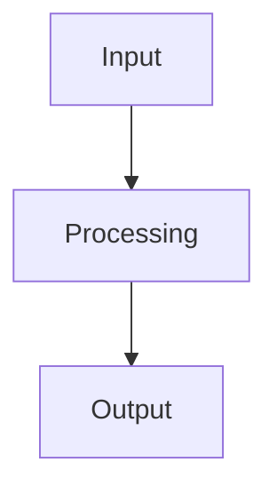

# Portfolio rebuild design spec

## Overview

Rebuild vaillant.ai from a minimal landing page + resume into a portfolio site with project pages. The site should make engineering thinking legible within 30-90 seconds. Target audience: technical hiring managers, engineering peers.

**Generator:** Eleventy (11ty)
**Output:** Static HTML to GitHub Pages
**Source of truth:** `resume.json` (JSON Resume format) for professional data, markdown files for project pages

## Decisions log

| Decision | Choice | Rationale |
|----------|--------|-----------|
| SSG | Eleventy | Markdown-first, data cascade auto-loads resume.json, no component framework overhead for a text-forward site |
| Landing layout | Projects-first with one-liners | Projects lead as primary content; contact/resume links recede to secondary row |
| Mermaid rendering | Build-time SVG via mermaid-cli | No client-side JS for diagrams, consistent with minimal-JS philosophy |
| `?a=2` switch | Shared JS module | Centralizes duplicated inline scripts, uses data attributes for targeting |
| Project prose | Structural placeholders only | Alice writes all narrative. Scaffolding provides headings and TODO markers. |
| resume.json projects | Sync to portfolio four | Storyverse, 7DRL, Paranoia Agent, Yapperbot replace current entries |

## File structure

```
vaillant.ai/
├── src/
│   ├── index.njk                  # landing page
│   ├── resume.njk                 # resume page
│   ├── projects/
│   │   ├── projects.json          # directory data: layout + tags
│   │   ├── storyverse.md
│   │   ├── 7drl.md
│   │   ├── paranoia-agent.md
│   │   └── yapperbot.md
│   ├── _includes/
│   │   ├── base.njk               # HTML shell: head, grid-bg, drift, vignette, name-switch.js
│   │   ├── project.njk            # project page layout
│   │   └── resume.njk             # resume page layout
│   ├── _data/
│   │   └── resume.json            # global data, accessible as {{ resume }}
│   ├── css/
│   │   ├── site.css               # existing, migrated
│   │   ├── resume.css             # existing, migrated
│   │   └── project.css            # project page styles
│   └── js/
│       ├── name-switch.js         # shared ?a=2 handler
│       └── resume.js              # resume client-side hydration
├── public/
│   └── CNAME
├── tests/
│   └── *.test.js
├── .eleventy.js
├── package.json
├── vitest.config.js
└── eslint.config.js
```

## Landing page

### Layout

Name and title at top, unchanged styling (clamp font, weight 300, accent-dim underline).

Below: project cards as primary content. Each card has:
- Left border (2px, `--accent-dim`)
- Project title as link (`--accent` color)
- One-line subtitle (`--accent-dim`, smaller font)

Cards sorted by `order` frontmatter from project markdown files.

Below projects: secondary link row separated by a top border. Compact horizontal layout containing Resume, GitHub, LinkedIn, Email — all in `--accent-dim`, same font size as current link styling but visually subordinate to projects.

### Data source

Project cards are generated from `collections.project` (Eleventy collection from the `project` tag). Title and subtitle come from frontmatter. No hardcoded project list in the template.

## Resume page

Functionally equivalent to current implementation. Changes:

- **Template:** `resume.njk` extends `base.njk` instead of standalone HTML
- **Data:** `resume.json` in `_data/` makes data available as `{{ resume }}` in the template. The build-resume.js script is removed.
- **Hydration:** `resume.js` stays for client-side rendering of resume sections (experience, education, skills, projects). The Nunjucks template writes `{{ resume | dump | safe }}` into a `<script type="application/json" id="resume-data">` tag at build time. `resume.js` parses this tag at runtime, same as today — the only change is Eleventy's data cascade replaces `build-resume.js` as the injection mechanism.
- **Styles:** `resume.css` migrated as-is. The `resume-body` class suppresses the vignette.
- **Nav:** Back link `← index` with `?a=2` propagation via `name-switch.js`

## Project pages

### Markdown structure

Each file in `src/projects/`:

```markdown
---
title: "Project Name"
subtitle: "One-line impact statement"
repo: "https://github.com/..." or null
demo: "https://..." or null
order: 1
---

## What it is

<!-- TODO: Alice writes this — one paragraph, lead with quantified impact -->

## Why it's hard

<!-- TODO: Alice writes this — the interesting engineering constraint -->

## How it works

<!-- TODO: Alice writes this — architecture and key decisions -->


<!-- TODO: Alice reviews/replaces diagram -->

## Decisions and tradeoffs

<!-- TODO: Alice writes this — why X over Y, what didn't work -->

## Metrics and outcomes

<!-- TODO: Alice writes this — quantified, not vanity -->
```

### Directory data file

`src/projects/projects.json`:
```json
{
  "layout": "project.njk",
  "tags": "project"
}
```

Applies to all markdown files in the directory. No per-file layout boilerplate.

### Project template (`project.njk`)

Extends `base.njk`. Renders:
1. Back nav: `← index` (with `data-name` attribute for name-switch, `?a=2` propagation)
2. `<h1>` from frontmatter `title`
3. Subtitle in `--accent-dim`
4. Markdown body (rendered HTML)
5. Footer: repo and demo links if non-null in frontmatter. Omitted entirely if both null.

### Project roster

| File | Title | Repo | Order |
|------|-------|------|-------|
| `storyverse.md` | Storyverse CV Pipeline | null (private) | 1 |
| `7drl.md` | A Long Day in Hell | github.com/A-Vaillant/a-long-day-in-hell | 2 |
| `paranoia-agent.md` | Paranoia Agent | github.com/A-Vaillant/paranoia-agent | 3 |
| `yapperbot.md` | Yapperbot | github.com/A-Vaillant/yapperbot | 4 |

### Styles (`project.css`)

Extends the CRT aesthetic for long-form reading:
- Same color variables as `site.css`
- `max-width: 680px` content column (matches resume)
- Heading styles consistent with resume section labels
- Mermaid SVG diagrams: full-width within content column, `--accent-dim` stroke colors, transparent backgrounds
- Code blocks if needed: same monospace, subtle border
- Mobile: same breakpoint (600px), fluid type

## Name switch (`?a=2`)

### Implementation

`src/js/name-switch.js` — loaded by `base.njk` on every page:

1. Parse `URLSearchParams` for `a` parameter
2. If `parseInt(a) === 2`:
   - Find all elements with `data-name` attribute → replace text via charcode (65,76,73,67,69 = target name)
   - Find all elements with `data-email` attribute → replace text and href via charcode
   - Find all internal `<a>` elements → append `?a=2` to href (or preserve existing query params)
3. No plaintext of the alternate name appears in source — charcode only

### Template integration

Templates use data attributes on switchable elements:
```html
<h1 class="name" data-name>ALEISTER<br>VAILLANT</h1>
<a href="mailto:aleister@vaillant.ai" data-email>aleister@vaillant.ai</a>
```

Structural elements only. Project page prose is not targeted.

## Mermaid build-time rendering

### Approach

Eleventy transform that runs after HTML rendering:

1. Find all `<pre><code class="language-mermaid">` blocks in output HTML
2. Extract diagram source text
3. Pipe each through `mmdc` (from `@mermaid-js/mermaid-cli`) with config:
   - Theme: dark
   - Background: transparent
   - CSS overrides for CRT-consistent colors
4. Replace the `<pre><code>` block with the resulting inline `<svg>`
5. SVGs inherit page styles for color consistency

### Mermaid config

A shared mermaid config file (`.mermaidrc.json`) at project root:
```json
{
  "theme": "dark",
  "themeVariables": {
    "primaryColor": "#0e1014",
    "primaryTextColor": "#b4c7d9",
    "primaryBorderColor": "#5a7080",
    "lineColor": "#5a7080",
    "secondaryColor": "#0e1014",
    "tertiaryColor": "#0e1014",
    "background": "transparent"
  }
}
```

## Build pipeline

### Scripts

```json
{
  "dev": "npx @11ty/eleventy --serve",
  "build": "npx @11ty/eleventy",
  "test": "vitest run",
  "test:watch": "vitest",
  "test:coverage": "vitest run --coverage",
  "lint": "eslint .",
  "validate": "npm run lint && npm run test"
}
```

### Eleventy config (`.eleventy.js`)

- Input directory: `src/`
- Output directory: `_site/`
- Template formats: `njk`, `md`
- Passthrough copy: `public/` → `_site/`, `src/css/` → `_site/css/`, `src/js/` → `_site/js/`
- Mermaid transform: post-render HTML transform
- Markdown library: markdown-it (Eleventy default) with fenced code enabled

### Deployment

GitHub Actions workflow (`.github/workflows/ci.yml`) updated:
- Install dependencies (including mermaid-cli)
- Run lint
- Run build (which includes mermaid rendering)
- Run tests
- Deploy `_site/` to GitHub Pages

### Pre-commit hook

Husky hook updated: `npm run build && npm test` (same as current, just triggers Eleventy instead of build-resume.js).

## Testing strategy

### Migrated from existing suite (adapted)

- File existence: key output files in `_site/`
- HTML validity: DOCTYPE, viewport meta, stylesheet links
- Link ordering: LinkedIn → GitHub in nav
- Accessibility: semantic heading hierarchy, link text, `<a>` tags for navigation
- Resume: sections render, data from resume.json present

### New tests

- **Project pages:** each markdown file produces an HTML page in `_site/projects/`
- **Project frontmatter:** title, subtitle render in output
- **Mermaid:** fenced mermaid blocks become `<svg>` elements (no `<code class="language-mermaid">` in output)
- **Landing page:** project cards present, sorted by order, with correct titles and subtitles
- **Name switch:** `name-switch.js` exists, no plaintext alternate name in any output HTML
- **`?a=2` link propagation:** internal links gain query parameter (tested via jsdom)
- **Resume data:** `resume.json` content accessible in rendered resume page
- **CNAME:** present in `_site/`

### Quality bar

Pre-commit blocks on lint or test failure. CI runs the same checks. No regression from current 23-test suite.

## Dependencies

### Added
- `@11ty/eleventy` — static site generator
- `@mermaid-js/mermaid-cli` — build-time diagram rendering
- `markdown-it` — likely bundled with Eleventy, explicit if needed

### Retained
- `vitest` — test framework
- `jsdom` — test environment
- `eslint` — linting
- `husky` — pre-commit hooks

### Removed
- `build-resume.js` — replaced by Eleventy data cascade

## resume.json updates

The `projects` array in `resume.json` is updated to match the portfolio four:

| Current | Replacement |
|---------|-------------|
| A Long Day in Hell | A Long Day in Hell (kept) |
| Paranoia Agent | Paranoia Agent (kept) |
| Factorio Working Group | Storyverse CV Pipeline |
| Petrock | Yapperbot |

Project descriptions, keywords, and URLs updated accordingly.

## Out of scope

- Blog or writing integration
- Contact forms, analytics, comments, anything dynamic
- "About me" prose beyond landing page
- Project narrative prose (Alice writes this)
- Visual design changes beyond the existing CRT aesthetic
- Any projects not in the four-project roster
