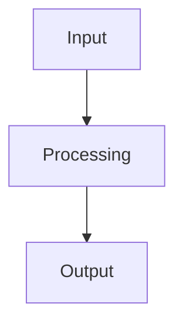

## What it is

<!-- TODO: Alice writes this — one paragraph, lead with quantified impact -->

## Why it's hard

<!-- TODO: Alice writes this — the interesting engineering constraint -->

## How it works

<!-- TODO: Alice writes this — architecture and key decisions -->

<!-- TODO: Alice reviews/replaces diagram -->

## Decisions and tradeoffs

<!-- TODO: Alice writes this — why X over Y, what didn't work -->

## Metrics and outcomes

<!-- TODO: Alice writes this — quantified, not vanity -->
